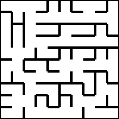
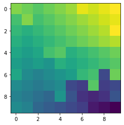
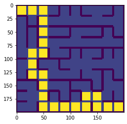

# Flood-fill
An algorithm to solve maze

<h2>Problem statement:</h2>
  A maze image,start cell coordinate and end cell coordinate will be provided. We have to find the path. Note that maze is given as an image.(So, image preprocessing stuff is involved here!!). Maze to be considered as 10*10 cells.
 
 
<b>Given maze:</b>
 

 
<h2>Solution:</h2>
 
First, lets interpret the maze image. Given is a 3 channel image, walls and boundries are black and free spaces are white. Since the image is a 3d matrix of numbers lets normalize it to 1d matrix for easy processing.
  
<b>Image normalization:</b>
 
Image is converted into single channel, where walls hold 0s and free spaces as 1
  
<b>Flood fill</b>
 
<i>Flood the matrix</i>
The algorithm proceed in the following way, 
1.Initialize marker variable value to 0 
2.Fill marker value to end cell and increment marker value 
3.Fill adjacent cell without wall inbetween with marker value 
4.Increment marker value 
5.Repeat step 3 and 4 till every cell in the matrix is filled. 
 

Once I filled the above maze it look like this, 

  

<b>Tracing the path</b>
 
Once, The matrix is filled the path can be traced by starting from the intial cell and moving to adjacent cell(Without wall inbetween) which has smallest value.
 
So, for above maze 

